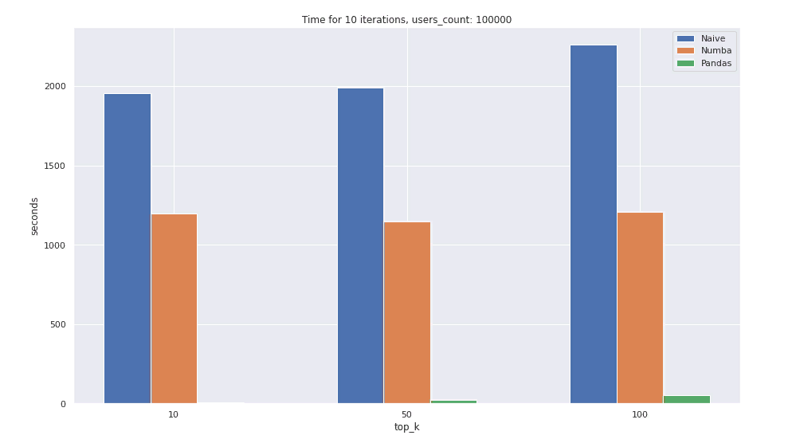

# MRR-Metric-Time-Comparison

Three different implementations of the Mean Reciprocal Rank (**MRR**) metric were made in order to compare their performance on different amounts of data. Those implementations are:
* Pandas (vector operations)
* Regular for loops (Naive)
* Regular for loops boosted with Numba (JIT-compilation)

**CPU**: Intel(R) Xeon(R) CPU @ 2.20GHz

Time table (seconds for 10 iterations):

| N users | Algorithm | MRR@10 | MRR@50 | MRR@100 |
| :---: | --- | :---: | :---: | :---: |
| | | | |
| 100 | Regular | 0.0442 | 0.1624 | 0.1900 |
|     | Numba | 0.0016 | 0.0014 | 0.0017 |
|     | Pandas | 0.0839 | 0.1098 | 0.0998 |
| | | | | |
| 1000 | Regular | 0.5998| 1.4408 | 2.2536 |
|      | Numba | 0.1126 | 0.1127 | 0.1172 |
|      | Pandas | 0.1190 | 0.2158 | 0.2908 |
| | | | | |
| 10000 | Regular | 20.711 | 30.434 | 37.648 |
|       | Numba | 10.991 | 11.492 | 11.145 |
|       | Pandas | 0.626 | 1.556 | 2.905 |
| | | | | |
| 100000 | Regular | 1989.523 | 1989.523 | 2261.472 |
|        | Numba | 1196.412 | 1145.607 | 1207.306 |
|        | Pandas | 7.183 | 19.685 | 49.375 |
| | | | | |

Visualization of time estimations for 10000 and 100000-user case scenarios:

More graphics [here](RecSysMetrics.ipynb)

## Conclusion:
Pandas vector operations show the best performance on big amounts of data and leave loop-implementations of the metric far behind. However, if loops cannot be avoided, Numba JIT-compilation noticeably decreases the operation time. Regular loop-implementation shows the worst results.

